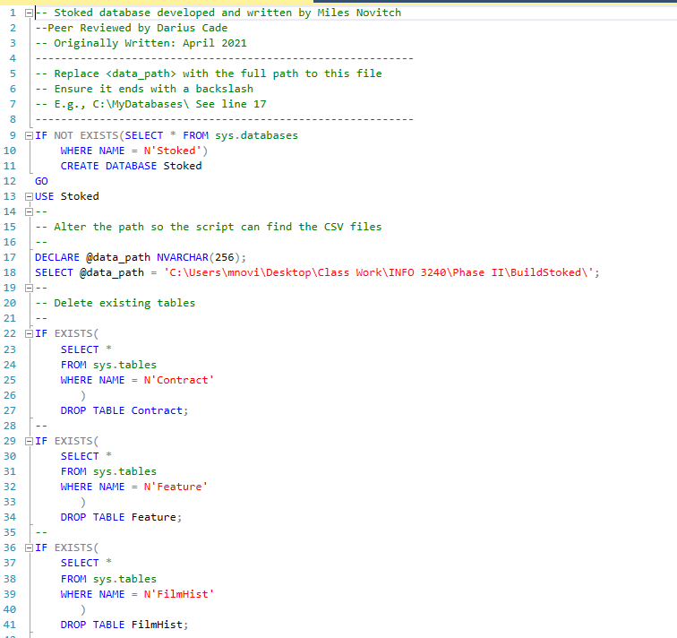

# Stoked 

Stoked is a winter sports movie streaming service, bringing you the latest and greatest in ski edits, montages, films. The purpose of this database is to keep track of all the production companies, movies, diretors, athletes, and sponsors that work with the company. This database can be used to make decisions about customer usage, movie popularity, athlete popularity, and geographical statistcs. 
  
We first started out by created an ERD.

 

 

We then had to create the build script. This first started with dropping and creating the tables.

 

 

Next, we had to bulk load in our data.

 

 

Now that our build script is done, we can move on to using it to create forms and reports using SQL queries. 
First, we have the startup form.

 

 

From here, we can go to the Athlete Search form to look up athletes by certain parametes. 

 

 

We also have our reports, such as this one which shows us Films by Production Company and Director.

 

 

[Back To Top](#top) | [Back To Main Page](../README.md/#top)
