
  
# Welcome to My Porfolio

  ## About Me
  My name is Miles Novitch, and I am a senior at the University of Denver. I am going to be receiving my BS in Business Administratrion from the Daniels College of Business, with a major in Business Analytics and a minor in Computer Science. Oringially from Los Angeles with a mind set of going into the film industry, I discovered early on in my college career that actually I wanted to work with technology and computers. Luckily, I have acquired a wide range of coding experince in different languages from the many classes I have taken here;everything from Database programming to using high-level and object-oriented languages, markup languages, and. Even though I am still trying to figure out which direction I want to go with my professional career, I know that my passion lies with data and coding. 
  
  

  
Quick Links: [My BIA Path](#path_bia)  |  [My Comp Sci Path](#path_cs)  |  [Soft Skills](#softskills)  |  [Programming Languages](#prog_lang)  |  [Projects](#projects)
  
  

   
  
  
  
  ## My Path Through BIA At Daniels
  
  #### INFO 1010 & 1020 (Data Management and Business Statistics)
  As the classes that kick-off the entire BIA program, this is where I got my first taste of working with data in the context of a business. They focused on intoducing us to   basic statistics, as well as how to utilize Microsoft Excel in a business or professional context. This inclulded how to interpret and understand data sets, how to clean data sets, and how to perform basic descriptive statistics on data sets. In fact, we ended all up getting certified in Microsoft Excel, as wellas Microsoft Word and Microsoft PowerPoint. Our projects included making an Infographic, cleaning a large data set, and performing descriptive statistics on research data. 
  
  #### INFO 2020 (Business Modeling)
  This course put more of an emphasis on the modeling side of data analytics. We were intoduced to a multitude of modeling techniques using Excel, such as multiple regression analysis, time series analysis, and simulation. We learned how these techniques could be used for forecasting, making better business decisions, and improving business processes. Our projects including performing a regression on research data, and performing a simulation on some ficticious road trip data.
  
  #### INFO 3100 (Automating Business Processes)
  This course was our first introduction to coding languages and focused on using Microsoft Excel and Python to support decision making for managers. Throughout, we learned how to automate tasks, such as reading/writing in, cleaning, formatting, and graphing data. This course was divided into two halves, with the first half focusing on VBA in Excel, and the second half focusing on Python. Within each language, we were taught how to utilize functions, objects, and methods to achieve the desired automation. Our first two projects consisted of reading in data from multiple files--one project being in VBA and the other in Python--and displaying the data in a neat and professional manner. The final project actually had us performing regressions and descriptive statistics through via entirely Python. 
  
  #### INFO 3200 (Data Mining & Visualization)
  This course was really where we started delving into the collection and presentation of data. One of the biggest lessons I took away from this class was that you can have all the data in the world and spend time and energy to analyze it, but whatever you can derive from it is completely useless unless you can communicate your results to other people. The easiest and most universal way to communicate complex topics is through visualization, and luckily we have many tools at our disposal to present data and statistical results, and to perform prediction modeling storytelling through visual means. The tools we mainly focused on were JMP and Tableau, with JMP focusing more on modeling, and Tableau focusing more on storytelling. In addition, we were also introduced to some basic R and R Markdown to help us with creating models and simulations. Our projects included performing a number of modeling techniques on a ficticious data set to help make predictions, and creating a visual dashboard for a company that included graphs and predictive models. 
  
  #### INFO 3140, 3240 & 3300 (Information Management and Data Warehousing)
  This 3-class sequence, in my opinion, is the backbone og the entire BIA program, and is where we are first introduced to the concepts of relational databases. The first class took an emphasis on planning, designing, and creating a relational databases in Microsoft Access. We were taught how to write and utilize SQL queries, as well as how to make functional forms and reports in Access. Once we got to the second class, we transitioned from using Access to using SQL Server and Visual Studio. We were taught how to build a database in SQL Server with only a script, and how to create interactive forms and reports in VS. Lastly, the third class took an emphasis on the data warehousing side of information management. Instead of building an OLTP, we learned how to take an existing OLTP and load it into data warehouse (OLAP) in order to keep historical data. Due to the fact each course in this sequence builds off the previous one, we ended up having on long project that spanned across all three. We had to design and create a relational databse for a ficticious company in both Access and SQL Server. We also had to create functional forms and reports in both Access and Visual Studio, and explain how they could be used to support business decisions. Lastly, we had to take our original OLTP from SQL Server and load it into a Data Warehouse that could be used to analyze historical data. 
  
  #### INFO 3340 (Project Management and Simulation)
  This couse mainly focused on managing projects and running simulations. While we had some very brief experience with coding in R in some of the previous classes, this class was really where we devled into its applications. Most of this class took place in R and R Studio, and we were taught how to write in the R Markdown language. We learned about different types of modeling and simulations, such as Monte Carlo simulation modeling, and how they could be used to inform business decisions and projects. We also discussed a lot about what it takes to manage projects and work with other people, as those are skills we will need to develop as we move into our chosen career paths. Our projects in this class consisted of creating multiple simulations in R Studio that could be used by a company, and explaining what the simulations tells and how it can be used to make good business decisions.
  
  
  
  ## My Path Through Computer Science
  
  #### COMP 1671, 1672 & 2673 (Introduction to Computer Science)
  This 3-class sequence are the introductory courses to the computer science program. We learned how to code in multiple languages, within multiple IDE's, and for multiple practical applications. They started out by teaching us the basics of coding a high-level object-oriented programming language -- Java. We learned how to create objects, classes, and functions, and how to use them in a problem-solving capacity. Once we got to the second class we were still working with Java, but the topics focused more on event-driven programming, recursion, and text file I/O. The final class in the sequence was taught in both Java and C++, and tackled much more complex coding topics such as binary search trees, doubly linked lists, and file systems.
  
  #### COMP 3410 (World Wide Web Programming)
  I decided to take this class as an elective to broaden my experiences with different coding languages. This course is also part of a 3-class sequence, and this first one is meant to teach us the ropes of coding in both HTML and JavaScript, and using them to design web pages. We were taught how to format text, insert media, and write functions and scripts using both languages. All of our projects consisted of creating web pages with various pieces of conent and functionality. 
  
  

   
  
  
  
  ## My Soft Skills
  
  #### Leadership Experience
  One of my soft skills that I pride myself the most on is my leadership abilities. I have acquired leadership experience over many years and throughout different activities and organizations. In high school, I was a dedicated member of our school's marching band and drumline, and received the role of Drum Captain my senior year. This position came with  a great deal of responsibility and required me to be an emaculate role model on top of being a musical section leader. Both on and off the field I was responsible for all others in my section and making sure we could all play our music as well as the rest of the band. This experience really helped set a good foundation for my leadership style and confidence, and is what inspired me to pursue later leadership opportunities. 
  
  Upon arrival at DU, I was excited explore more leadership opportunities among different student organizations. One club I ended up joining was the community service fraternity, Alpha Phi Omega. My junior year, I got elected to a leadership position and to serve on the executive board. Again, I served as a role model to the rest of the group and I was introduced to many new responsibilities. I had to lead group activities, plan events, play leadership roles in important rituatls, and just generally be active and social with all the members.

Another student organization that I ended up joining was the social fraternity, Delta Chi. I joined this group my freshman year, and was active in it throughout my entire undergrad. While I was in this fraternity, I served 3 separate leadership positions across 3 separete terms. My third position, however, was by far the most important and most impactful on my leadership abilities. I was on the executive board as the secretary, meaning I was responsible for reserving event spaces, taking notes at meetings, organizing and moderating our communication chanels, relaying information about our chapter to the national organization, and keeping track of every member's attendance throuhgout the year. Additionally, since we are a big social fraternity on campus, I was one of the faces and representative of the organization; what I did reflect on the rest of my peers. This experience really taught me how to organize myself and utilize my time properly, as there were many points in which I faced important deadlines for paperwork that needed to be turned in to the university or to nationals. It also really helped me gegeranlly sharpen my leaderhsip abilities across the board. 
  
  #### Communitcation & Teamwork
  In addition to giving me great leadership experience, my leadership roles at DU also heavily contributed to my communication skills. As the Secretary of a fraternity, I had to make sure that ever single member was up to date on our chapter's events, current business, and goals. Being heavily involved, I also had to keep track of multiple communication channels, including text chats, messenger app chats, Slack channels, and emails, as well as relay important information betweem them. Holding that position taught me how to stay organized in a chaotic environment like that, and how to not fall behind or get complacent with communications. However, having good communication isn't everything--you also need to know how to work in a group and work as a team. As a fraternity we had many goals, such as raising a certain amount of money for philanthropy, volunteering a certain number of community service hours, or recruiting a certain amount of new members. Achieving these goals required myself and the rest of the chapter to work together and work with a purpose.
  
  Delta Chi was not the place where I got to practice and encorporate teamwork. Throughout my many classes in the business school, including the BIA program, I have been a part of countless group projects and presentations. All of these projects require not only good communication between team members, but also a good amount of cooperation and teamwork. There were many points in which I took on the leader role of a group and was responsible for our submissions, and there were also times were I was acting merely as a team-player; in either case, the one thing that stayed consistent was the fact that the only way to achieve the outcome we wanted was by working together in a way that utilized our strengths and minimized our weaknesses. 
  
  ### Problem Solving & Working Under Pressure
  While I have no prior experience in a data analyst work environment, I do have experience with problem solving in a high-pressure environment. The summer of my junior year I wokred at a pizza place, both in the kitchen and as a delivery driver. At the time, our store was very understaffed but in quite a populous location, meaning we often received more orders than we could handle, and meaning I would often be doing both kicthen and delivery at the same time. My shifts were extremely stressful, as I had to make a prep the food while keeping track of the orders while also pulling deliveries and helping out customers at the front. Because I had so many tasks I had to do at once, and because I was under time constraints with how long it takes to make and deliver the food, this job really taught me how to work well under pressure. There were also many instances in which orders or delivery got messed up, and I had to figure out what the best course of action was on the fly. Being able to quickly solve problems while respecting your other responsibilities is a skill that I was definitely able to develop here, and is something I hope to apply to a job in my professional career.
  
  

   
  
  
  
  ## Programming Languages I've Used
  Below are screenshots and snippets of code from some of programming language I have used throuhgout college. 
  
  <table border="1" align="center">
    <tr>
      <th>VBA</th>
      <th>Python</th>
    </tr>
    <tr>
      <td>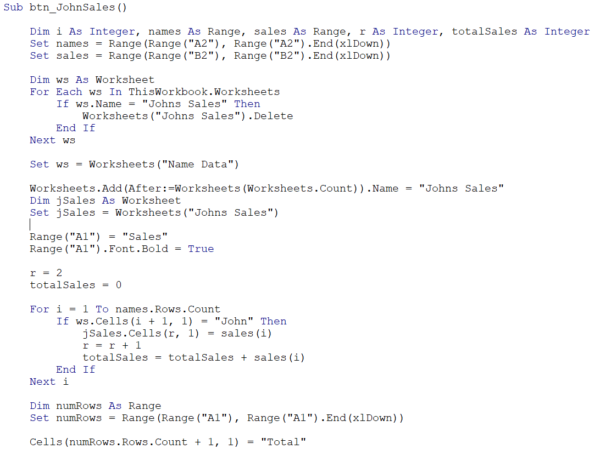</td>
      <td>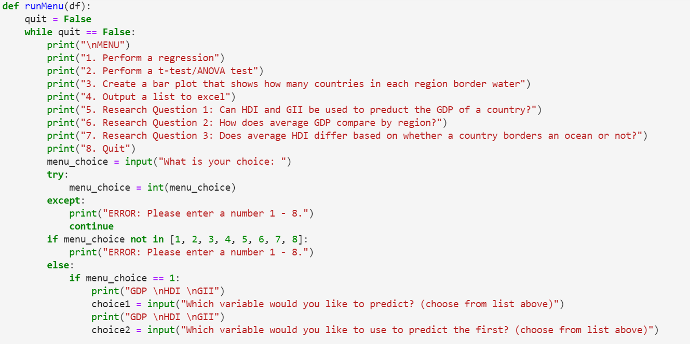</td>
    </tr>
    <tr>
      <th>Java</th>
      <th>R</th>
    </tr>
    <tr>
      <td>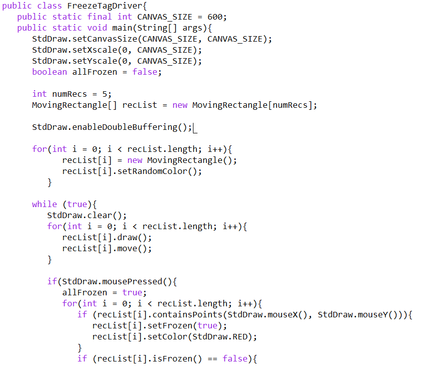</td>
      <td>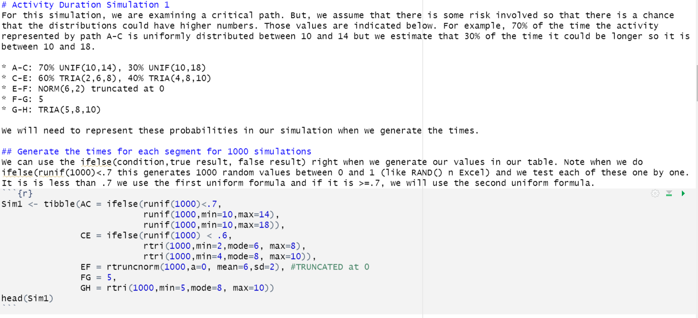</td>
    </tr>
    <tr>
      <th>HTML</th>
      <th>JavaScript</th>
    </tr>
    <tr>
      <td>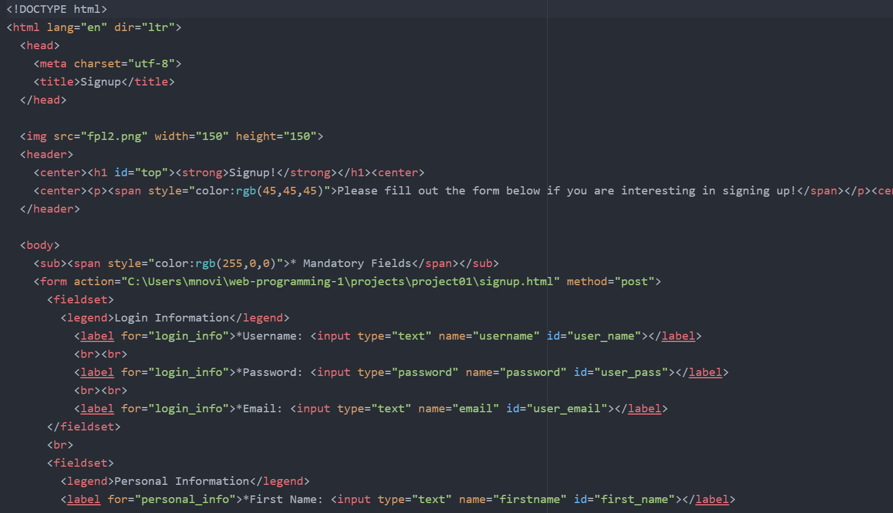</td>
      <td>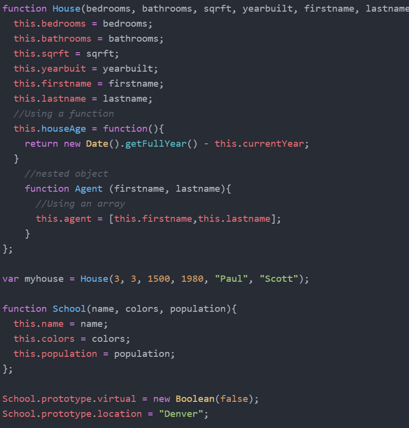</td>
    </tr>
    <tr>
      <th colspan="2">SQL</th>
    </tr>
    <tr>
      <td>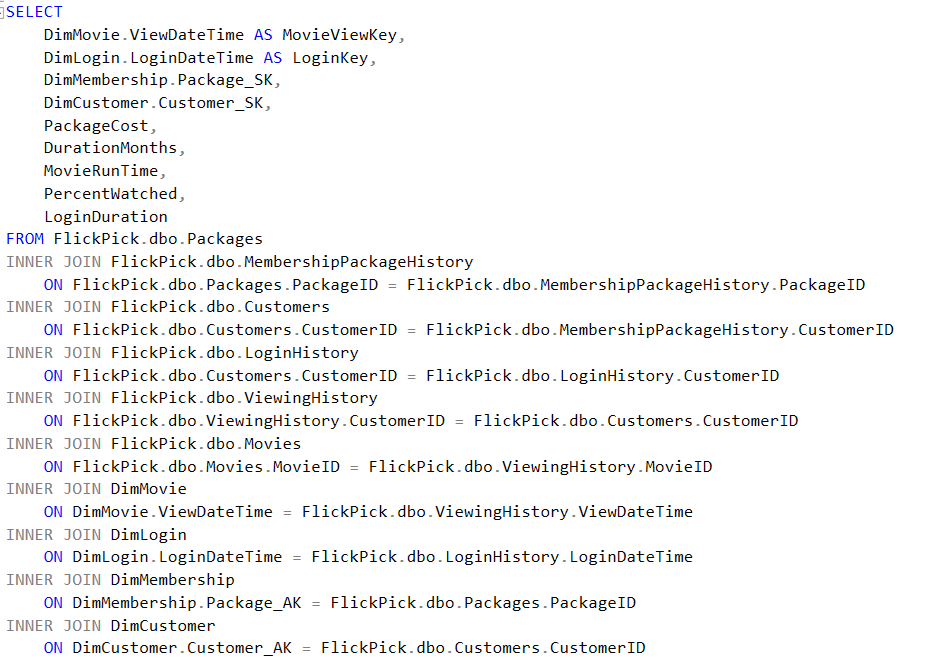</td>
      <td>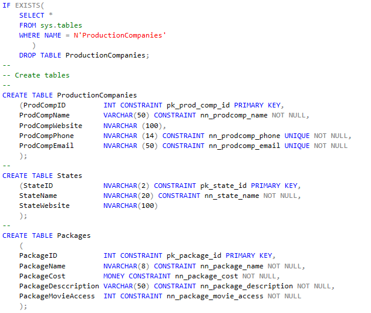</td>
    </tr>
  </table>
  
  

   
  
  
  
  ## My Projects
  
  ### Database Project - Stoked
  
  Stoked is a winter sports movie streaming service, bringing you the latest and greatest in ski edits, montages, films. The purpose of this database is to keep track of all the production companies, movies, diretors, athletes, and sponsors that work with the company. This database can be used to make decisions about customer usage, movie popularity, athlete popularity, and geographical statistcs. 
  
We first started out by created an ERD.

 

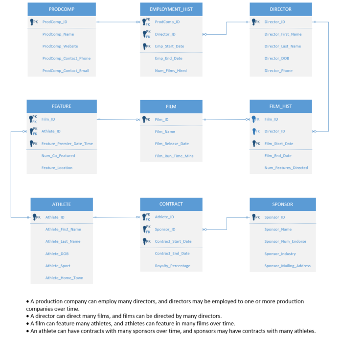

 

We then had to create the build script. This first started with dropping and creating the tables.

 

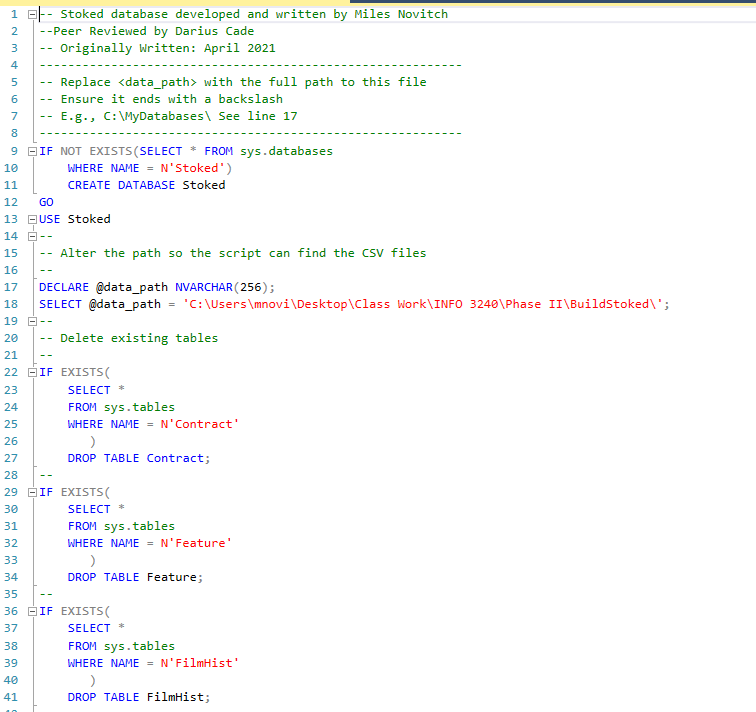

 

Next, we had to bulk load in our data.

 

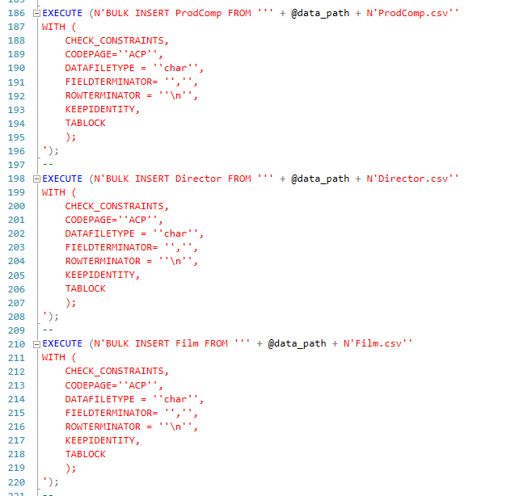

 

Now that our build script is done, we can move on to using it to create forms and reports using SQL queries. 
First, we have the startup form.

 

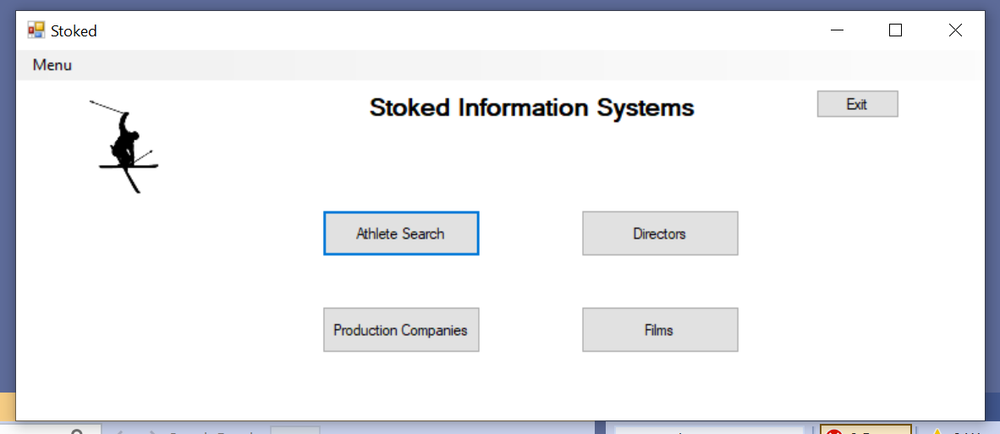

 

From here, we can go to the Athlete Search form to look up athletes by certain parametes. 

 

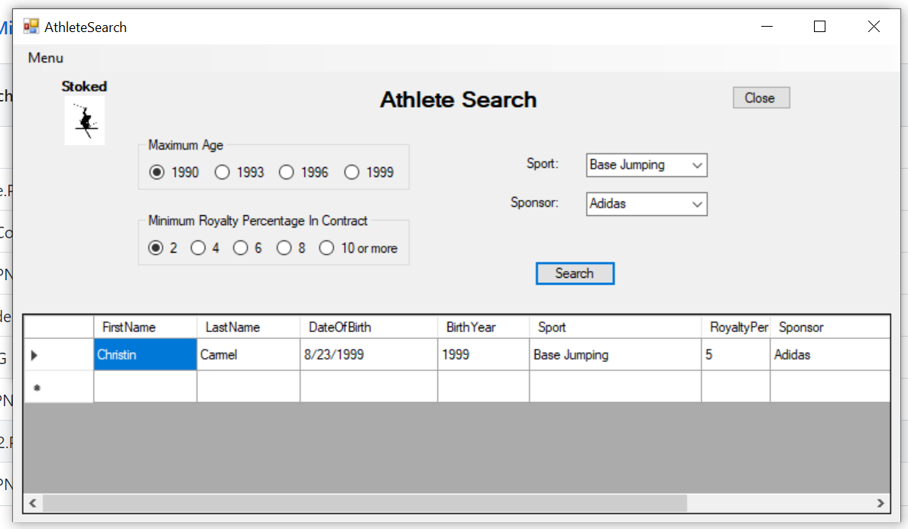

 

We also have our reports, such as this one which shows us Films by Production Company and Director.

 

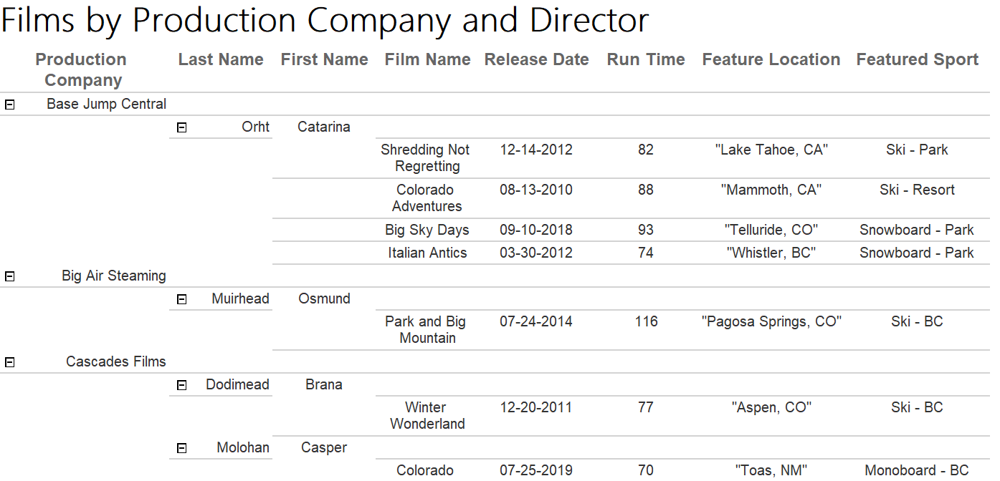

 

### Infographic Project

For these projects, we had to create an infographic that conveyed some research statistics.
